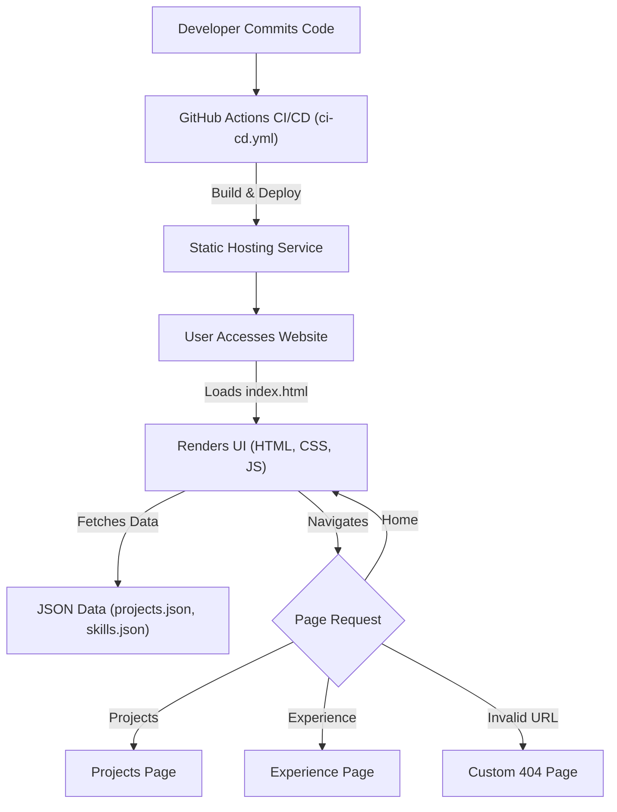

# 🚀 Portfolio Website

<p align="center"></p>

## Short Description
Dive into a meticulously crafted, modern, and highly responsive online portfolio designed to effectively showcase an individual's skills, projects, and professional journey. This repository embodies best practices in frontend development, offering an immersive user experience and a robust platform for presenting a professional online presence.

## ✨ Key Features
*   **Dynamic & Engaging UI/UX:** Experience a captivating interface powered by interactive JavaScript effects (`particles.min.js`) and seamless transitions, ensuring an unforgettable browsing journey.
*   **Comprehensive Project Showcase:** Explore a dedicated section (`projects/index.html`, `projects/projects.json`) that meticulously highlights diverse projects, complete with detailed descriptions and visuals.
*   **Articulated Skillset Overview:** Gain insight into a broad range of technical proficiencies and tools, structured for clarity and impact using `skills.json`.
*   **Professional Experience Timeline:** Navigate through a detailed career trajectory on a dedicated experience page (`experience/index.html`), outlining key roles, responsibilities, and achievements.
*   **Automated CI/CD Pipeline:** Leveraging GitHub Actions (`.github/workflows/ci-cd.yml`) for continuous integration and deployment, ensuring the portfolio is always up-to-date and reliably delivered.
*   **Downloadable Resume:** Provides direct access to a professionally formatted resume (`assests/resume.pdf`) for easy review and download by interested parties.
*   **Custom 404 Error Page:** A bespoke error page (`404.html`) enhances user experience by gracefully handling broken links and guiding visitors back to relevant content.
*   **Fully Responsive Design:** Optimized for a flawless display and interactive experience across all devices, from desktops to mobile phones.

## Who is this for?
This project is an essential asset for:
*   **Aspiring & Experienced Developers:** A professional template to launch or upgrade your personal branding and online presence.
*   **Job Seekers:** A powerful tool to impress potential employers by demonstrating both technical prowess and a curated body of work.
*   **Freelancers & Consultants:** Effectively showcase your capabilities and past projects to attract new clients.
*   **Collaborators & Peers:** A central hub to explore collaboration opportunities and understand your expertise.
*   **Anyone interested in modern web development:** A tangible example of a well-structured and engaging static site.

## Technology Stack & Architecture
*   **Frontend Technologies:** HTML5, CSS3, and JavaScript (Vanilla JS).
*   **Styling & Interactivity:** Custom CSS (`style.css`, `404.css`) and `particles.min.js` for dynamic visual effects.
*   **Content Management:** JSON files (`projects.json`, `skills.json`) for modular and easily updateable content.
*   **Build & Deployment:** GitHub Actions for automated Continuous Integration and Continuous Deployment.
*   **Development Environment:** Configured with Visual Studio Code (`.vscode/settings.json`) for streamlined development.

## 📊 Architecture & Database Schema

The Portfolio Website is a static web application, focusing on direct content delivery rather than complex database interactions. Its architecture emphasizes a smooth user experience and efficient deployment.



## ⚡ Quick Start Guide
Get your local copy of this dynamic portfolio up and running in minutes!

1.  **Clone the Repository:**
    ```bash
    git clone https://github.com/shravnip901-sudo/portfolio_website.git
    ```
2.  **Navigate to the Project Directory:**
    ```bash
    cd portfolio_website
    ```
3.  **Open in Browser (Local View):**
    For a quick preview, simply open the `index.html` file directly in your preferred web browser.
    ```bash
    # Example (macOS/Linux)
    open index.html
    # Example (Windows)
    start index.html
    ```
4.  **Run with a Local Server (Recommended for full functionality):**
    To ensure all assets load correctly and for a better development experience, serving the site via a local HTTP server is recommended.
    *   **Using Python's Simple HTTP Server:**
        ```bash
        python -m http.server 8000
        # Then, open your browser and navigate to http://localhost:8000
        ```
    *   **Using `live-server` (if you have Node.js/npm installed):**
        ```bash
        npm install -g live-server
        live-server
        ```

## 📜 License
This project is licensed under the terms found in the `LICENSE` file within this repository.